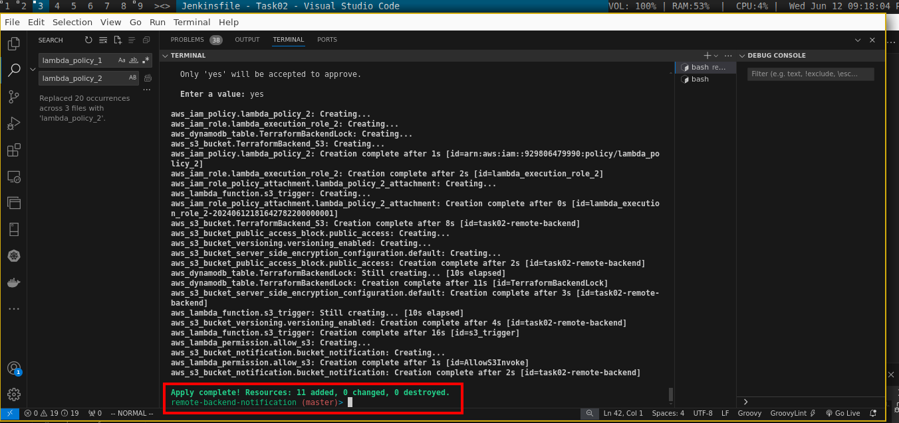
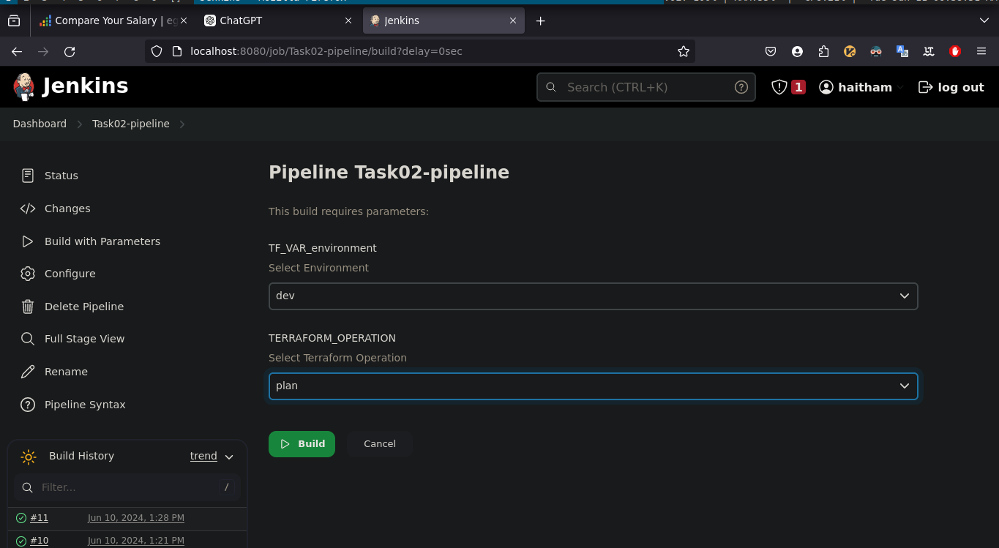

# Storing and Tracking Terraform State Files in AWS S3

This project sets up a basic AWS infrastructure using Terraform modules. The infrastructure includes a VPC with public and private subnets, a Bastion host, a NAT gateway, and a private instance. Additionally, it configures a remote backend on S3 for storing Terraform state files, and sets up a Lambda function to trigger an SNS topic, which sends an email notification to the DevOps Engineer whenever changes occur in the S3 bucket.

## Table of Contents


- [Architecture](#architecture)
- [Modules](#modules)
- [Remote Backend](#remote-backend)
- [Notificatin](#notification)
- [Applying Terraform Configurations](#applying-terraform-configurations)
- [Building CICD Pipeline](#building-cicd-pipeline)

## Architecture

The infrastructure includes the following components:
- VPC with public and private subnets

- Bastion host in the public subnet

- NAT gateway in the public subnet

- Private instance in the private subnet

- S3 bucket for remote backend storage

- DynamoDB table for locking to manage concurrent Terraform state operations
- Lambda function triggered by S3 events
- SES (Simple Email Service) for sending email notifications

  
  <center><p>(Project Architecture)</p></center>

   
  <center><p>(Terraform Graph)</p></center>

## Modules

### VPC Module
The VPC module establishes a private network environment on AWS with specified settings, including DNS support and hostnames. Additionally, it attaches an internet gateway to enable external internet access for resources within the VPC.

[View VPC Module Code](./modules/vpc/main.tf)

### Subnets Module
The subnet code defines both public and private subnets within the VPC. Public subnets are configured with internet access via a route table linked to an internet gateway, while private subnets route traffic through a NAT gateway for outbound connectivity.

[View Subnets Module Code](./modules/subnets/main.tf)

### SRV Module
The server module provisions an Elastic IP, creates a NAT gateway, and deploys both a Bastion host and a private instance. Security groups are established for each, allowing SSH access, and an inventory file is generated listing their respective IP addresses.

[View SRV Module Code](./modules/srv/main.tf)

## Remote Backend
To configure the remote backend, a separate directory containing Terraform code is created. Within this directory, an S3 bucket named "task02-remote-backend" is provisioned to store Terraform state file. Versioning and server-side encryption are enabled to maintain revision history and enhance data security. Additionally, all public access to the bucket is explicitly blocked to prevent unauthorized access. Furthermore, a DynamoDB table named "TerraformBackendLock" is created to manage locking for concurrent state operations, ensuring consistency and integrity. 
[View Remote backend code](./remote-backend-notification/s3-dynamodb.tf)

After creating the remote backend components, it's essential to configure main [remote-backend.tf](./remote-backend.tf) state file to utilize the newly created S3 bucket.to meet your specific changes. 

## Notification
In this part, an AWS Lambda function is provisioned to be triggered by S3 events. It includes creating an IAM role and policy for Lambda execution, defining the Lambda function, and setting up permissions and S3 bucket notifications to invoke the Lambda function when bjects are created or deleted in the bucket.
[View Notification code](./remote-backend-notification/ses-notification.tf)

## Applying Terraform Configurations 
* Step One: Create Backend s3 bucket with notication. 
  1. Enter `remote-backkend-notification` folder 

      ```bash  
      cd remote-backkend-notification
      ```
  2. Apply Terraform code 
    
      ```bash 
      terraform init 
      terraform apply
      ```
      
      
      

* Step two: Apply Project Entire Infrastructure 
  1. In The main project directory run the following commands 
  
     ````bash
     terraform inti 
     terraform apply -var-file prod.tfvar
     ````

       
  
    <center><p>(Project Infra) </p></center>
  
  2. in the same project main Dir there are two files will be generated one is `inventory` and the second is the private key which is created and download `task02-key`
        
  
    <center><p>(inventory-task02-key) </p></center>
  
  3. Connecting to the private instance. 
  
     
     <center><p>(Connect to bastion host)</p></center>

  4. Connect to the private instance with ssh agent  forwarding 
   
     <center><p>(Connect to private instance)</p></center>  

## Building CICD Pipeline
I created a Jenkins Pipeline to automate deployment tasks using Terraform. I use parameters for the environment and Terraform operation types, allowing choices between 'dev' and 'prod' environments and 'plan', 'apply', or 'destroy' operations. The pipeline consists of several stages:

1. Checkout: Download conde from my github repo. 
2. Terraform Init: initializes Terraform within the designated directory, setting up the necessary environment for subsequent operations.
3. Terraform Workspace: ensuring that the appropriate workspace for the selected environment.
4. Terraform Operation: to chose Terraform operation based on the parameters provided, including 'plan', 'apply', or 'destroy'. Depending on the operation selected, the pipeline generates a Terraform plan, applies changes, or destroys existing infrastructure.

    [View Jenkinsfile code](./Jenkinsfile)


<center><p> Jenkins Paramter </p><center>


<center><p> Run Pipeline </p> </center>


<center><p> Success Build </p> </center